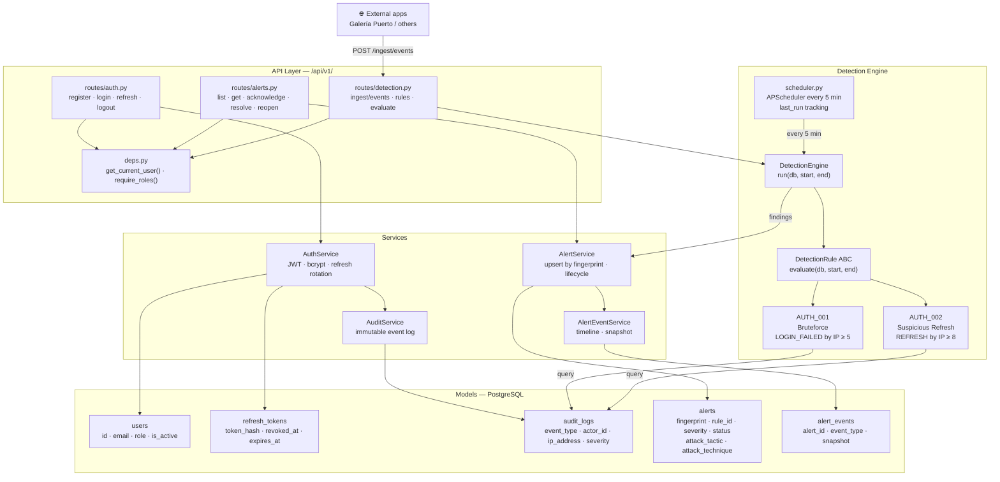
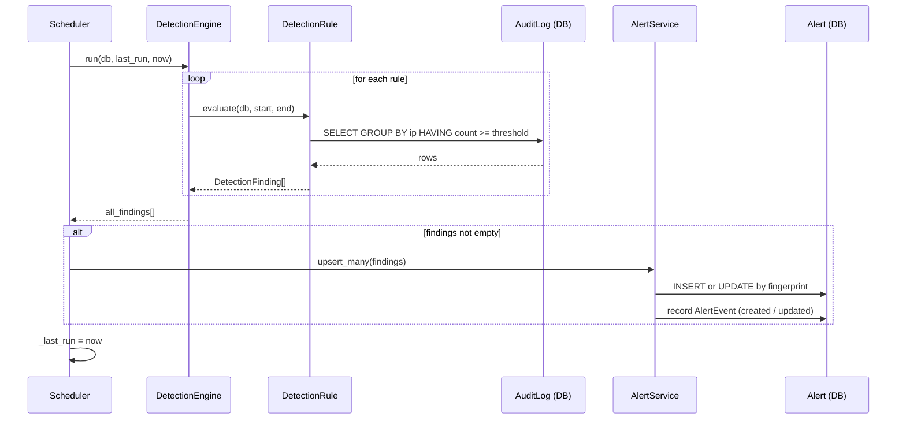
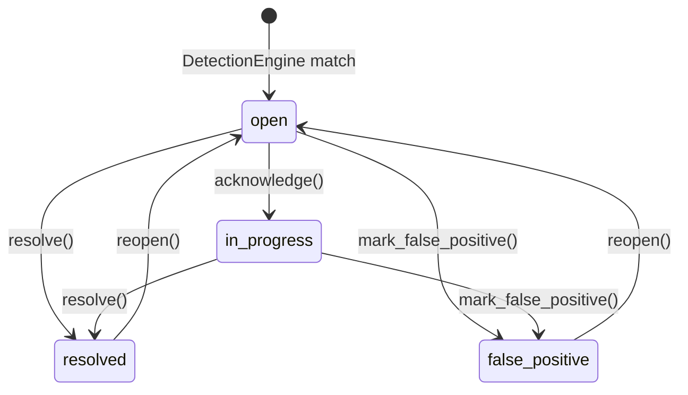
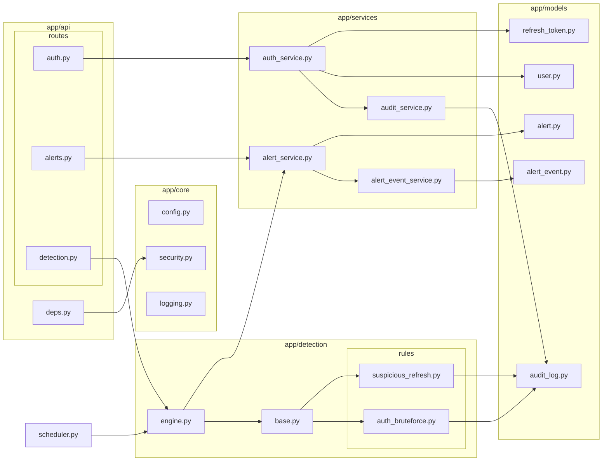

# SentinelLab

A defensive security platform built for learning and demonstrating 
real-world backend security concepts — threat detection, audit logging, 
RBAC, and AppSec analysis.

## What it does

- JWT authentication with refresh token rotation
- Role-based access control (admin, analyst, viewer)
- Structured audit logging (JSON)
- Threat detection engine with Sigma-style rules
- AppSec lab with intentionally vulnerable endpoints (OWASP Top 10)
- Static file analyzer (hashes, strings, metadata)
- MITRE ATT&CK log ingestion and classification
- PDF report generation

## Stack

- **Backend:** Python + FastAPI
- **Database:** PostgreSQL + SQLAlchemy (async)
- **Cache/Queue:** Redis + ARQ
- **Migrations:** Alembic
- **Auth:** JWT + bcrypt + refresh token rotation

## Status

Active development — building milestone by milestone.

| Milestone | Status |
|-----------|--------|
| M1: Foundation & Config | ✅ Done |
| M2: Auth, JWT, RBAC | ✅ Done |
| M3: Audit System | 🔨 In progress |
| M4: Detection Engine | ⏳ Pending |
| M5: Alerts | ⏳ Pending |
| M6: AppSec Lab | ⏳ Pending |
| M7: File Analyzer | ⏳ Pending |
| M8: Blue Team + MITRE | ⏳ Pending |
| M9: Reports | ⏳ Pending |

## Run locally

```bash
# Clone and setup
git clone https://github.com/hxcCoder/Sentinel-workflow-engine
cd Sentinel-workflow-engine

# Create virtual environment
python3 -m venv venv
source venv/bin/activate

# Install dependencies
pip install -r requirements.txt

# Configure environment
cp .env.example .env
# Edit .env with your values

# Run migrations
alembic upgrade head

# Start server
uvicorn app.main:app --reload
```

## Graphics:

# SentinelLab — Architecture

## System flow



## Detection cycle



## Alert lifecycle



## Module map


