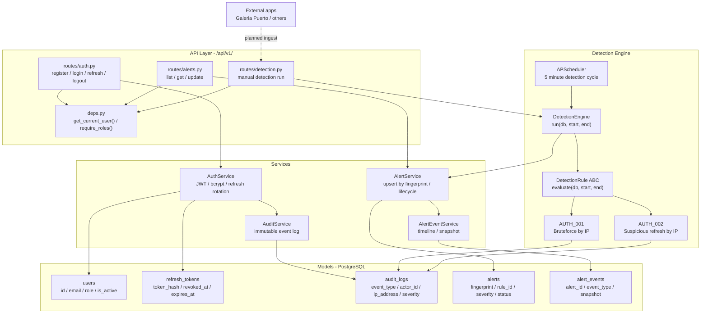

# SentinelLab

A defensive security backend built for learning and demonstrating real-world
backend security concepts: authentication, audit logging, RBAC, rule-based
detection, and alert lifecycle management.

## What it does

- JWT authentication with refresh token rotation
- Role-based access control: admin, analyst, viewer
- Structured audit logging
- Rule-based detection engine
- Alert persistence and lifecycle tracking
- AppSec lab, file analysis, MITRE enrichment, and reporting are planned

## Stack

- Backend: Python, FastAPI
- Database: PostgreSQL, SQLAlchemy async
- Migrations: Alembic
- Auth: JWT, bcrypt, refresh token rotation

## Status

Active development, building milestone by milestone. The current source of
truth is [docs/architecture-registry.md](docs/architecture-registry.md).

| Milestone | Status |
|---|---|
| M1: Foundation and config | Done |
| M2: Auth, JWT, RBAC | Done |
| M3: Audit system | Done |
| M4: Detection engine | Done |
| M5: Alerts and operational closure | Done for current scope |
| M6: AppSec lab | Planned |
| M7: File analyzer | Planned |
| M8: Blue Team and MITRE | Planned |
| M9: Reports | Planned |

## Run locally

```bash
python3 -m venv venv
source venv/bin/activate
pip install -r requirements.txt
alembic upgrade head
uvicorn app.main:app --reload
```

## Documentation

- [North Star](northstar.md)
- [Architecture registry](docs/architecture-registry.md)
- [Session log](docs/session-log.md)

## System flow


